# FreeEEG32 Flashing via AC6 w/ STM32F103 Blue Pill

#### Materials

[STM32F103C8T6 "Blue Pill"](https://stm32-base.org/boards/STM32F103C8T6-Blue-Pill.html)
Make sure it's genuine!

FT232RL USB to UART converter OR ESP32 developer board

FreeEEG32 board.

2x MicroUSB cords

#### Software:

##### Blue Pill software (Windows only)
[STM32 Flasher Demonstrator GUI](https://www.st.com/en/development-tools/flasher-stm32.html)

CMSIS-DAP V1 F103 Firmware (included in this repo under /Firmware/CMSIS-DAP_hex)

##### FreeEEG32 software
[System Workbench for STM32](https://www.openstm32.org/System%2BWorkbench%2Bfor%2BSTM32) (registration required, recommend you use this on Ubuntu 16.04 or 18.04 as this is how we will access OpenVibe)

FreeEEG32 Firmware (included in this repo under /Firmware/AC6)

## Setting up the Blue Pill

This part adapted from [Circuit Digest](https://circuitdigest.com/microcontroller-projects/programming-stm32f103c8-board-using-usb-port)

With the STM32 Flasher Demonstrator GUI installed and the CMSIS-DAP firmware downloaded, wire up your Blue Pill to your USB-UART converter 
(you can’t use the Micro-USB port by default) like so:
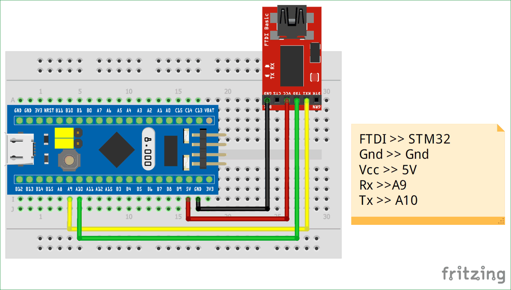

Place the Blue Pill in programming mode by placing the TOP yellow jumper pin in this image to the “1” position.

*If using an ESP32 dev board instead of an FT232RL, short the EN to GND first to disable the ESP32 chip and use only the USB-UART chip on-board.*

Plug the USB-UART converter into the computer after it’s wired up and then open the Flasher Demonstrator GUI. Select the correct COM port 
for the USB-UART converter and hit next.
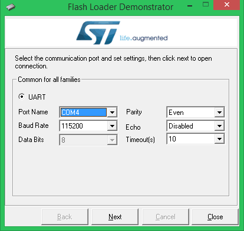

Click next, see that the Blue Pill has been found (adjust the wires and reopen the GUI to try again if it doesn’t work the first time), 
and then select your Blue Pill’s memory size (64K is the most common, the previous window tells you the memory size). 
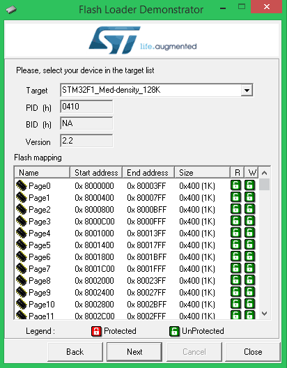

In the next window select “Download to device,” navigate to the CMSIS-DAP_hex folder in the Firmware folder of this repo and select "CMSIS-DAP-V1-F103.hex" and click Next
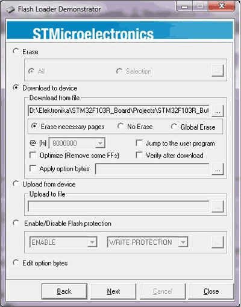

You should see it downloading to the device, the progress bar turns green on success. You are finished setting up your Blue Pill! Place it back into Operating mode by switching the jumper back to the 0 position.

Check if it worked by removing the USB-UART converter and plugging into the MicroUSB port on the Blue Pill. You should see the CMSIS-DAP be recognized on the Windows computer.

## Flashing the FreeEEG32

First, in /Firmware/AC6 unzip the STM32H743ZI_alpha1.5_SD_CDC.zip/.tar.xz
to the same folder.

With AC6 installed, click on the .cproject file in the newly unzipped folder 
to open it.

First select Project > Build All to build the firmware.

Now we need to set up the debug configuration real quick. 

In the tool bar click Run > Debug Configurations

Select Ac6 STM32 Debugging then click the New icon in the top left corner. Name this CMSIS-DAP or something.

In the Main tab, select Browse under Project: and select the current project, then in the C/C++ Application section select Search Project and it should fill out with the .elf file automatically.

In the Debugger tab, select User Defined under Configuration Script and find "STM32H743ZI_alpha1.5.cfg" under the current project folder.
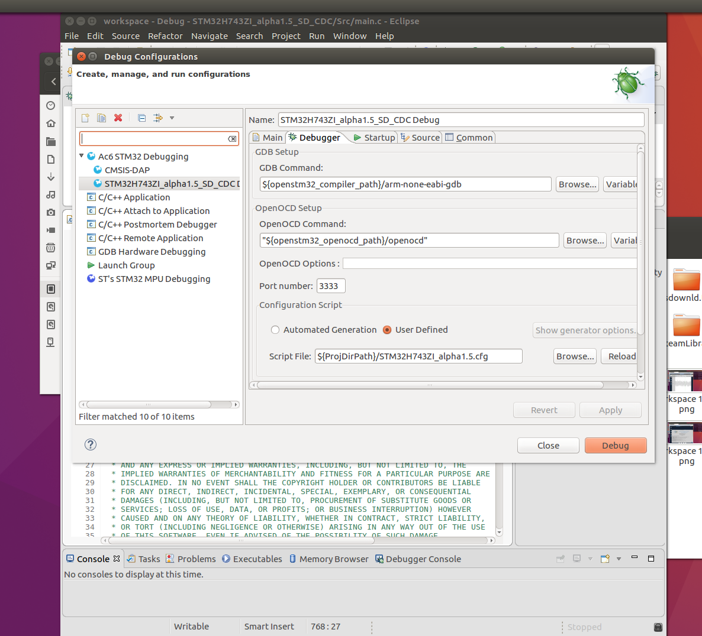

With that set, now let's wire up the Blue Pill to the FreeEEG32. Connect the Blue Pill to the pins near the buttons like so:

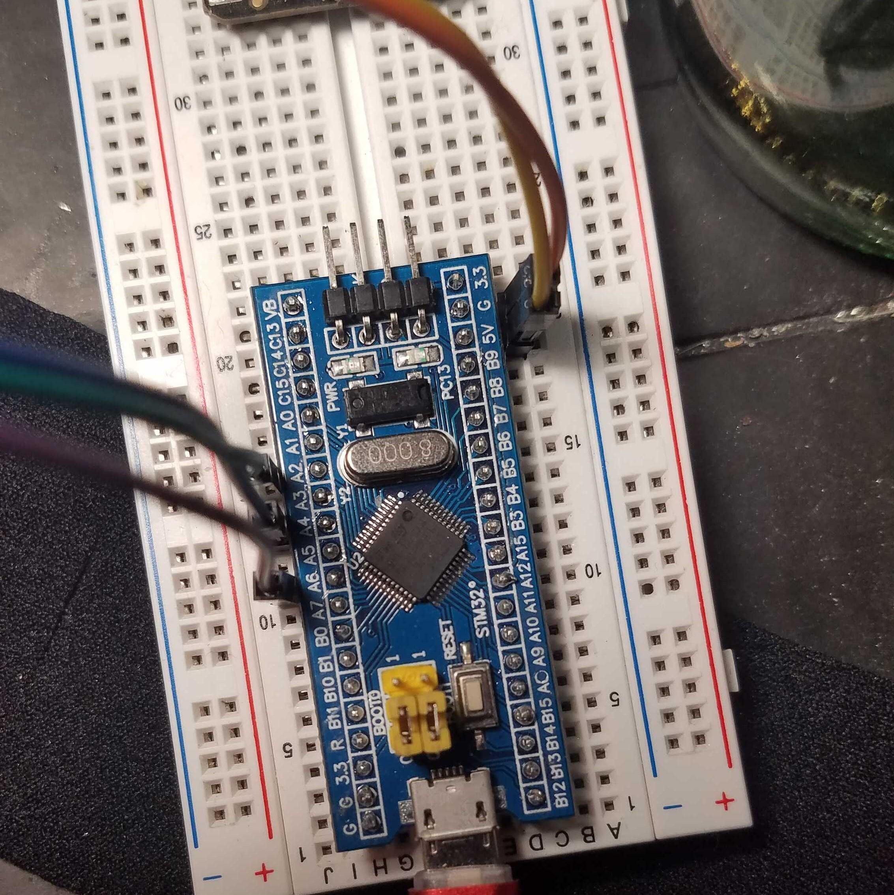

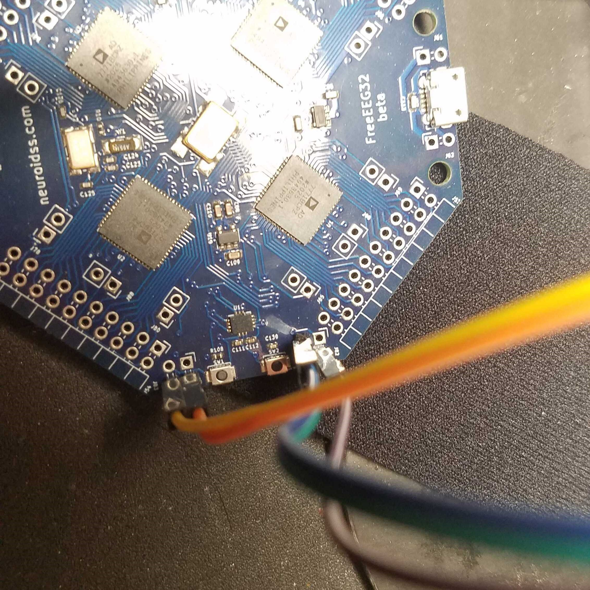

Now plug in the CMSIS-DAP via MicroUSB as well as the FreeEEG32's power USB slot.

Now, holding down the boot button firmly, click Run (the green Play button) to upload the firmware. This may take a few tries.

If it's working you'll see it say "Programming started" and hang for a bit,
then you should see it eventually scroll a bunch then you'll see a message "Verified OK" meaning it's done.
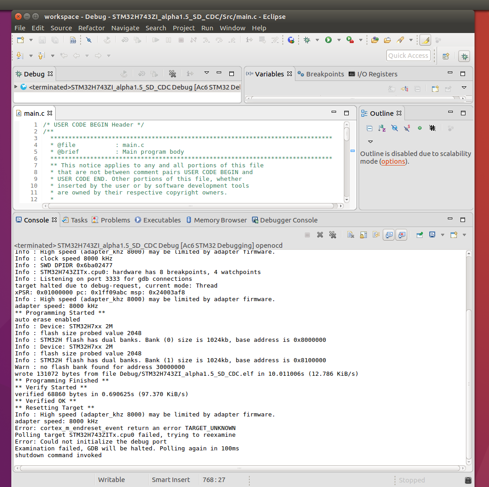

To test if it worked, first unplug everything then remove the Blue Pill. Then plug the EEG in via both USB ports.

Assuming you are on Ubuntu now, open a terminal and type in "lsusb", you should see an ST Microelectronics STM32F407 board recognized. That's the EEG!
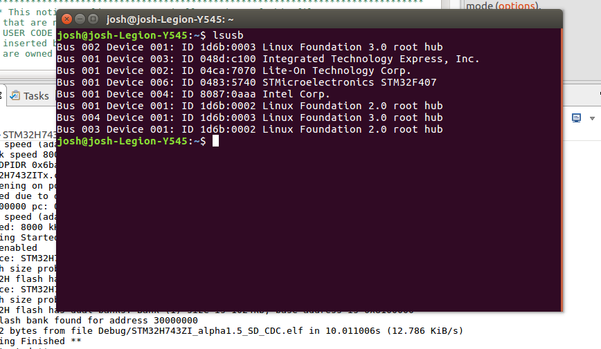

To read the output you must use something like putty, and the baud rate is 921600. On Ubuntu the device will be at /dev/ttyACM0 when plugged via MicroUSB.

If you do not see output, ensure that the USB output is enabled in main.c of the firmware by uncommenting the setting shown and commenting out the old one then reflashing:
The setting you want uncommented is "#define FREESMARTEEG_SEND (FREESMARTEEG_SEND_UART1 | FREESMARTEEG_SEND_USBHS)", additional settings can send data to the SD slot.
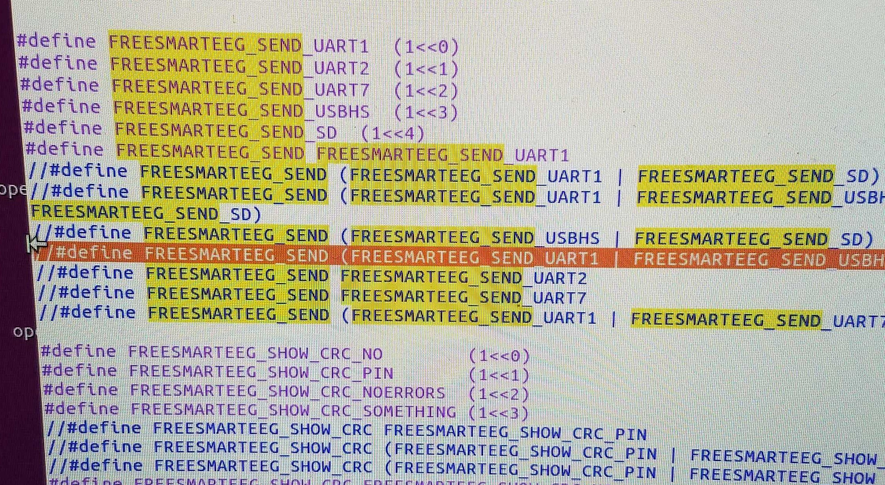

Alternatively, you can use a USB-UART converter on the UART pins (see diagram above), wired up like so:
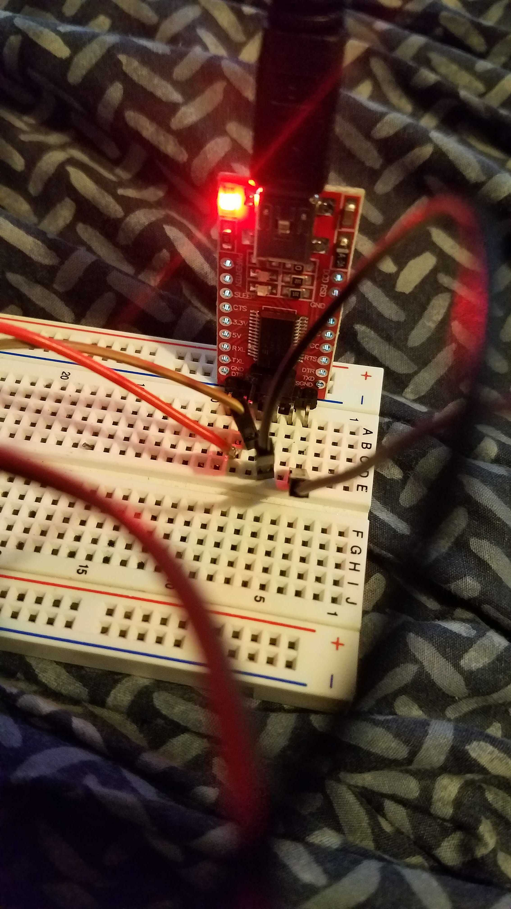
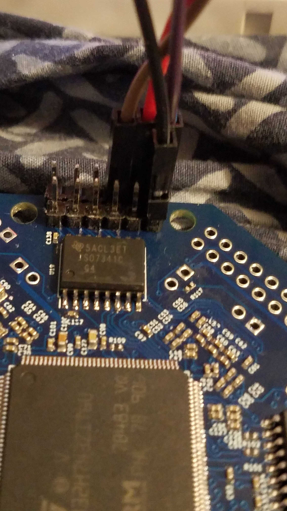

This concludes this guide. Now we can move on to testing the signal output with OpenVibe!

